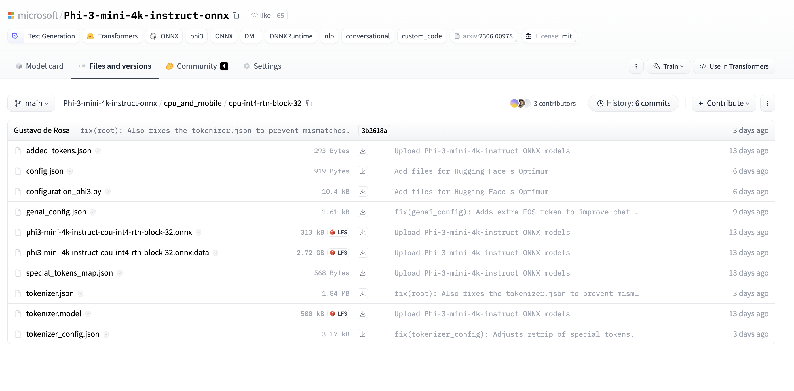
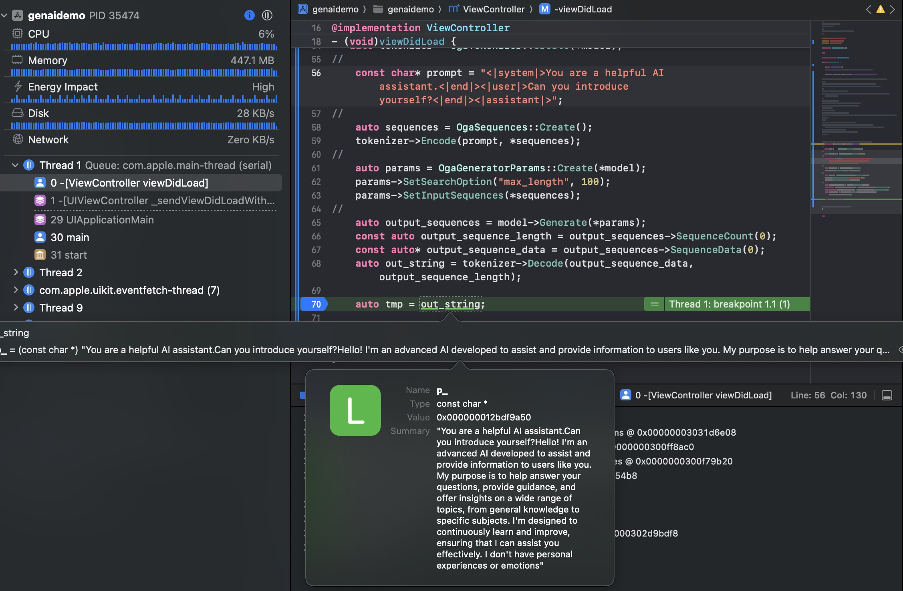

# **This is samples for phi3-mini running on iPhone**

please follow this guidline

## **Steps**

 ### **A. Preparation**


1. macOS 14+

2. Xcode 15+
   
3. iOS SDK 17.x 
   
4. Install Python 3.10+ (Conda is recommended)
   
5. Install the Python library - python-flatbuffers

6. Install CMake


### **B. Compiling ONNX Runtime for iOS**

```bash

git clone https://github.com/microsoft/onnxruntime.git

cd onnxruntime

./build.sh --build_shared_lib --ios --skip_tests --parallel --build_dir ./build_ios --ios --apple_sysroot iphoneos --osx_arch arm64 --apple_deploy_target 17.4 --cmake_generator Xcode --config Release

```
 
***Notice*** 

  1. Before compiling, you must ensure that Xcode is configured correctly and set it on the terminal


```bash

sudo xcode-select -switch /Applications/Xcode.app/Contents/Developer 

```
 
  2. ONNX Runtime needs to be compiled based on different platforms. For iOS, you can compile based on arm64 / x86_64
   
  3. It is recommended to directly use the latest iOS SDK for compilation. Of course, you can also lower the version to be compatible with past SDKs.


### **C. Compiling Generative AI with ONNX Runtime for iOS**


 ***Note:*** Because Generative AI with ONNX Runtime is in preview, please note the changes.


```bash

git clone https://github.com/microsoft/onnxruntime-genai

cd onnxruntime-genai

git checkout yguo/ios-build-genai


python3 build.py --parallel --build_dir ./build_ios_simulator --ios --ios_sysroot iphoneos --osx_arch arm64 --apple_deployment_target 17.4 --cmake_generator Xcode

```


### **D. Create an App application in Xcode**

I chose Objective-C as the App development method , because using Generative AI with ONNX Runtime C++ API, Objective-C is better compatible. Of course, you can also complete related calls through Swift bridging.


### **E. Copy the ONNX quantized INT4 model to the App application project**

We need to import the INT4 quantization model in ONNX format, which needs to be downloaded first



After downloading, you need to add it to the Resources directory of the project in Xcode.


 ### **F. Add the C++ API in ViewControllers**

 
***Notice***:

  1. Add the corresponding C++ header file to the project


  


  2. add onnxruntime-gen ai dylib in Xcode

  
  
 
  3. Directly use the code on C Samples for testing in this samples. You can also directly add moreto run(such as ChatUI）

  4. Because you need to call C++, please change ViewController.m to ViewController.mm

```objc

    NSString *llmPath = [[NSBundle mainBundle] resourcePath];
    char const *modelPath = llmPath.cString;

    auto model =  OgaModel::Create(modelPath);

    auto tokenizer = OgaTokenizer::Create(*model);

    const char* prompt = "<|system|>You are a helpful AI assistant.<|end|><|user|>Can you introduce yourself?<|end|><|assistant|>";

    auto sequences = OgaSequences::Create();
    tokenizer->Encode(prompt, *sequences);

    auto params = OgaGeneratorParams::Create(*model);
    params->SetSearchOption("max_length", 100);
    params->SetInputSequences(*sequences);

    auto output_sequences = model->Generate(*params);
    const auto output_sequence_length = output_sequences->SequenceCount(0);
    const auto* output_sequence_data = output_sequences->SequenceData(0);
    auto out_string = tokenizer->Decode(output_sequence_data, output_sequence_length);
    
    auto tmp = out_string;

```


### **G. Look at the running results**




***Notice:*** Please run in iPhone device , iOS 17.4